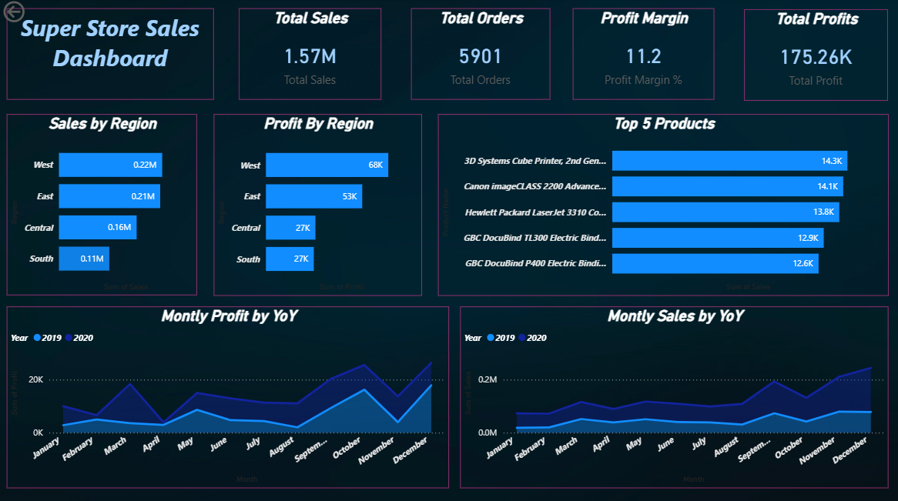

# 📊 Business Sales Performance Analytics  
## Data Science Internship – Task 1  

---

## 🔹 Objective  
Analyze business sales data to identify revenue trends, top-selling products, high-value categories, and regional performance.

---

## 🛠 Tools Used  
- Power BI   
- DAX  

---

## Dataset  
SuperStore Sales Dataset  

---

## 📈 Key Insights  

1. The West region generated the highest overall revenue.  
2. Technology category contributed the highest profit margins.  
3. Certain sub-categories show high sales but low profitability.  
4. Discount levels significantly impact overall profit.  
5. Sales show seasonal trends across different months.  

---

## 💡 Business Recommendations  

1. Focus marketing efforts on high-performing regions.  
2. Optimize discount strategy to improve profit margins.  
3. Promote high-profit categories more aggressively.  
4. Review low-performing sub-categories for cost optimization.  

---

## Repository Structure  

-  Data – Raw dataset  
-  Dashboard – Power BI dashboard file  
-  Report – Insight summary PDF  
-  README.md  

---

## 📌 Dashboard Preview 

